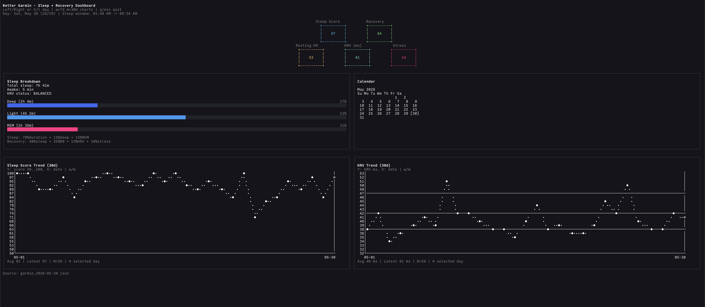

# Better Garmin

A small **vibe-coded** personal Garmin dashboard project.



This repo has:
- `backend/` — Python scripts to fetch and cache Garmin data (`garminconnect`)
- `frontend/` — OpenTUI terminal dashboard for sleep/recovery metrics and trends

## What it does
- Pulls Garmin summary/sleep/activity data
- Caches daily JSON files in `backend/cache/`
- Renders a terminal UI with:
  - sleep score + recovery metrics
  - HRV metrics
  - monthly/weekly trend charts
  - calendar highlight for selected day

## Quick start

### 1) Backend setup
```bash
cd backend
python3 -m venv .venv
source .venv/bin/activate
pip install -r requirements.txt
cp .env.example .env
# fill GARMIN_EMAIL / GARMIN_PASSWORD
```

### 2) Fetch data
```bash
cd backend
source .venv/bin/activate
python fetch_garmin.py --days 30
```

By default this uses cached files when they are still within the cache TTL and prints a compact summary. Use `--refresh` to force Garmin API reads, or `--json` if you explicitly need the full cached/fetched payload printed to stdout.

### 3) Run TUI
```bash
cd frontend
bun install
bun run src/index.tsx
```

## Controls (TUI)
- `left/right` or `h/l` — change inspected day
- `w` — 7 day chart view
- `m` — 30 day chart view
- `q` / `esc` — quit

## Test
```bash
./test.sh
```

---
Personal project for exploring Garmin data with a cleaner terminal-first UI.
